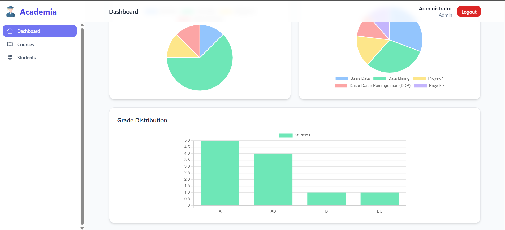
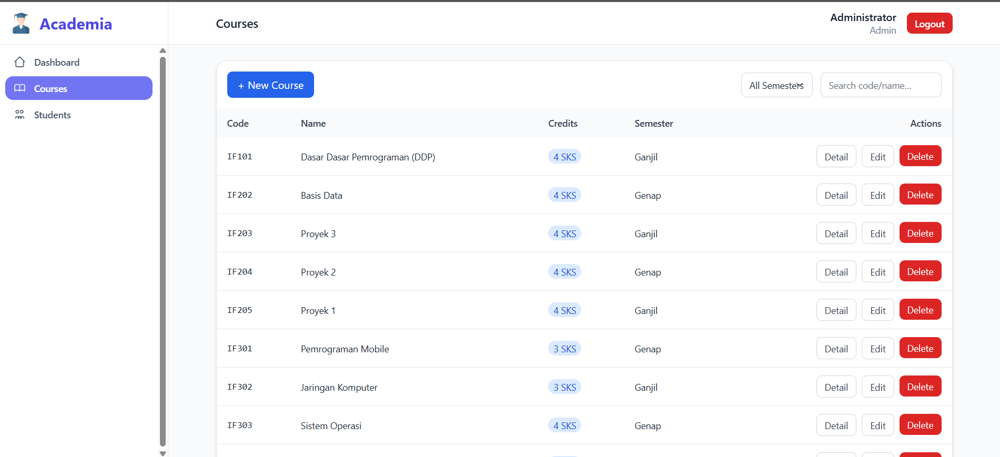
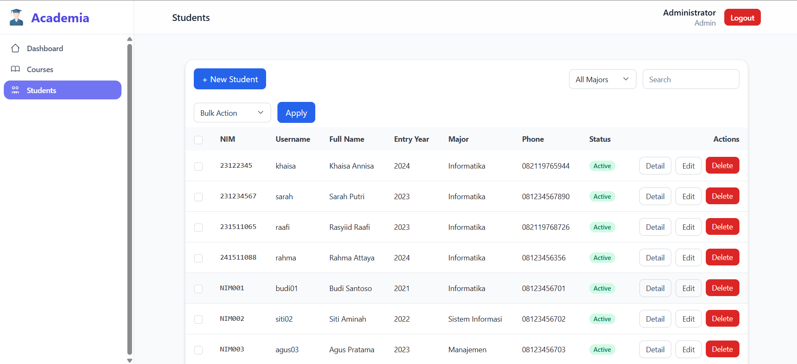
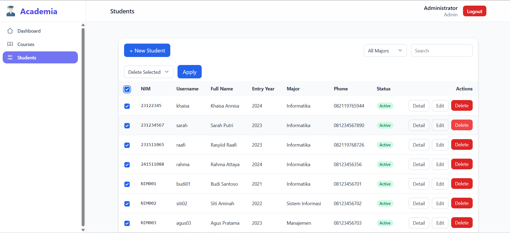
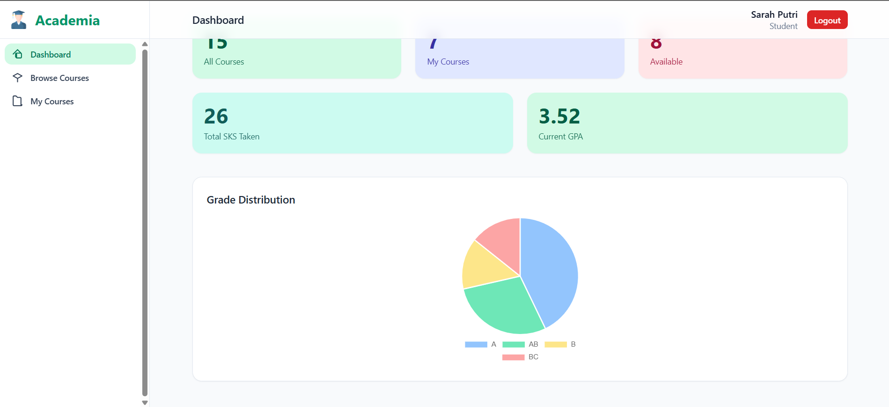
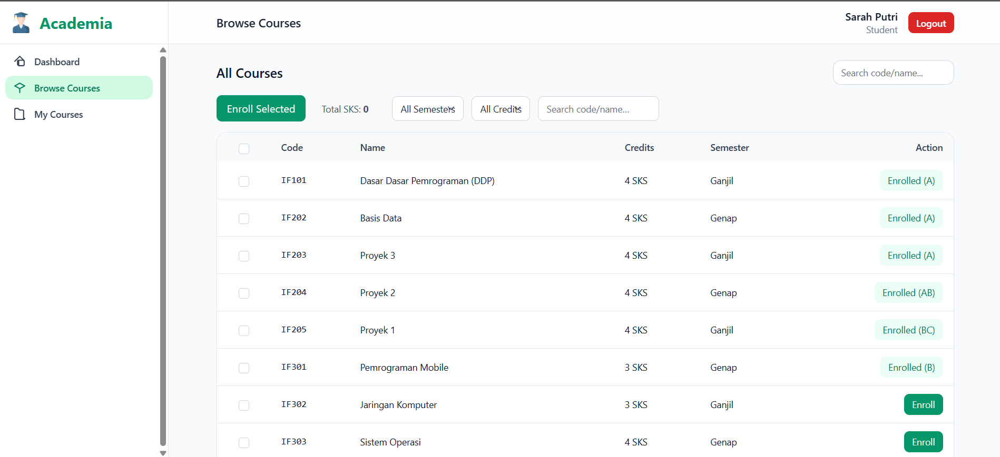
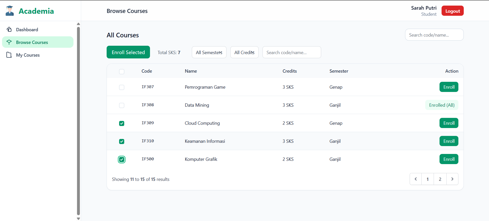
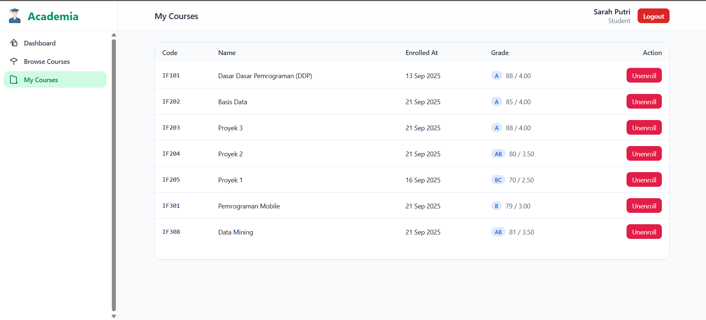

# Academia – Student Course Management

## ✨ Penjelasan Singkat
Aplikasi web berbasis **Laravel** untuk mengelola mahasiswa dan mata kuliah.  
- **Admin**: mengatur data mahasiswa & courses, melakukan bulk actions, serta melihat dashboard analitik.  
- **Student**: memiliki dashboard pribadi, dapat browse & enroll courses dengan perhitungan SKS realtime, serta melihat progress nilai.

---

## 🔑 Fitur Utama
### 1. Authentication & Role Based
- Login Admin & Student.  
- Logout dengan modal konfirmasi.  

### 2. Manajemen Mahasiswa (Admin)
- CRUD mahasiswa.  
- Bulk activate/deactivate/delete dengan modal konfirmasi.  
- Status aktif/nonaktif ditampilkan dengan badge.  

### 3. Manajemen Course (Admin)
- CRUD courses.  
- Filter & search course.  
- Detail course menampilkan enrolled students.  

### 4. Dashboard Admin
- Statistik total mahasiswa & courses.  
- Chart distribusi mahasiswa per jurusan.  
- Chart top 5 popular courses.  
- Chart distribusi nilai/grade.  

### 5. Dashboard Student
- Lihat profil & statistik (SKS & GPA).  
- Browse Courses dengan filter & search.  
- Checklist multiple course → total SKS realtime.  
- Enroll course dengan modal konfirmasi.  
- My Courses: daftar course + nilai.  

### 6. UX & Komponen Umum
- Sidebar dengan menu aktif highlight.  
- Form validation dengan error message.  
- Modal konfirmasi (delete, logout, enroll, bulk action).  
- Tampilan chart interaktif dengan Chart.js.  

### 7. Landing Page
- Halaman awal sederhana untuk memperkenalkan aplikasi.  

---

## 🛠 Teknologi
- Laravel 10+  
- Blade Template Engine  
- TailwindCSS  
- Chart.js  
- Vanilla JavaScript (DOM, Event Handling, Async Demo)  
- Database: SQLite/MySQL  
- Vite  

---

## 📸 Screenshots

### Landing Page

### Login

### Dashboard Admin

### Manage Courses (Admin)

### Manage Students (Admin)

### Bulk Action (Admin – Students)

### Dashboard Student

### Browse Courses (Student)

### Bulk Action (Student – Enroll Multiple)

### My Courses (Student)

