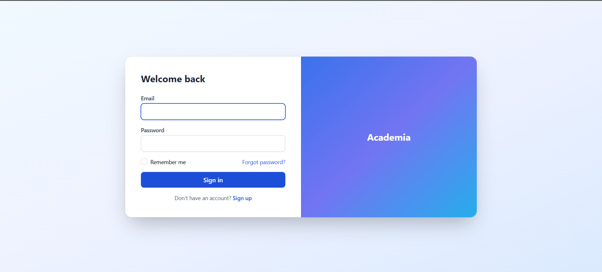
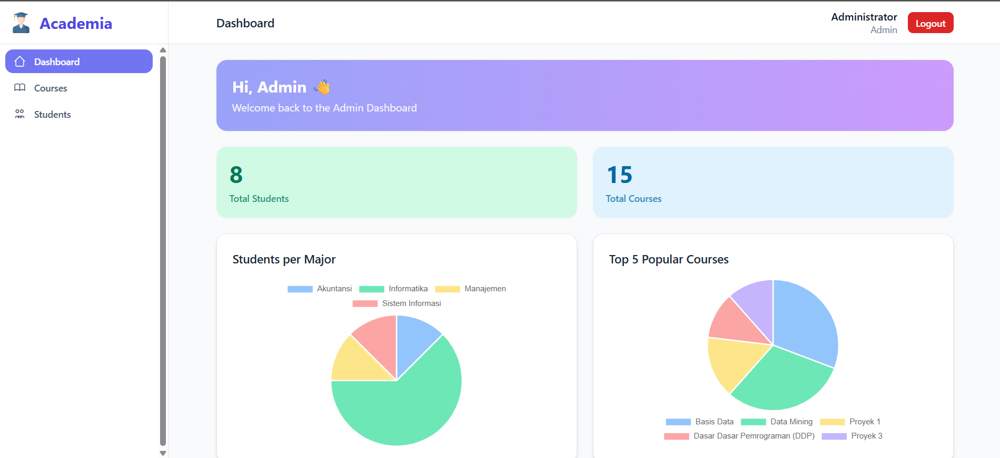
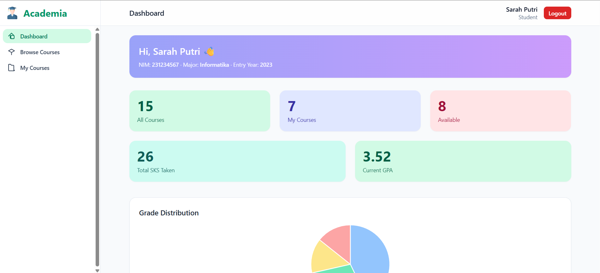

# Academia – Student Course Management

## ✨ Penjelasan Singkat
Aplikasi web sederhana berbasis Laravel untuk mengelola mahasiswa dan mata kuliah.  
Admin bisa mengatur mahasiswa & courses, melakukan bulk actions, serta melihat dashboard analitik dengan chart.  
Student bisa melihat dashboard pribadi, browse courses, enroll courses dengan kalkulasi SKS, serta melihat progress nilai.

---

## 🔑 Fitur Utama
1. **Authentication & Role Based**
   - Login Admin & Student.
   - Logout dengan modal konfirmasi.

2. **Manajemen Mahasiswa (Admin)**
   - CRUD mahasiswa.
   - Bulk activate/deactivate/delete dengan modal konfirmasi.
   - Status aktif/nonaktif ditampilkan dengan badge.

3. **Manajemen Course (Admin)**
   - CRUD courses.
   - Filter & search course.
   - Detail course menampilkan enrolled students.
   - Bulk enroll mahasiswa ke course.

4. **Dashboard Admin**
   - Statistik total mahasiswa & courses.
   - Chart distribusi mahasiswa per jurusan.
   - Chart top 5 popular courses.
   - Chart distribusi nilai/grade.

5. **Dashboard Student**
   - Lihat profil & statistik.
   - Browse Courses dengan filter & search.
   - Checklist multiple course → total SKS realtime.
   - Enroll course dengan modal konfirmasi.
   - My Courses: daftar course + nilai.

6. **Common Use Cases & UX**
   - Menu aktif berubah style.
   - Form validation dengan error message.
   - Modal delete confirmation.
   - Async demo (setTimeout).

---

## 🛠 Teknologi
- Laravel 10+
- Blade Template Engine
- TailwindCSS
- Chart.js
- Vanilla JavaScript (DOM, Event Handling, Async Demo)
- Database: SQLite/MySQL
- Vite

---

## 📸 Screenshot
### Login

### Dashboard Admin

### Dashboard Student

### Browse Courses (Student)

### Bulk Actions (Admin – Students)

### Chart Example

